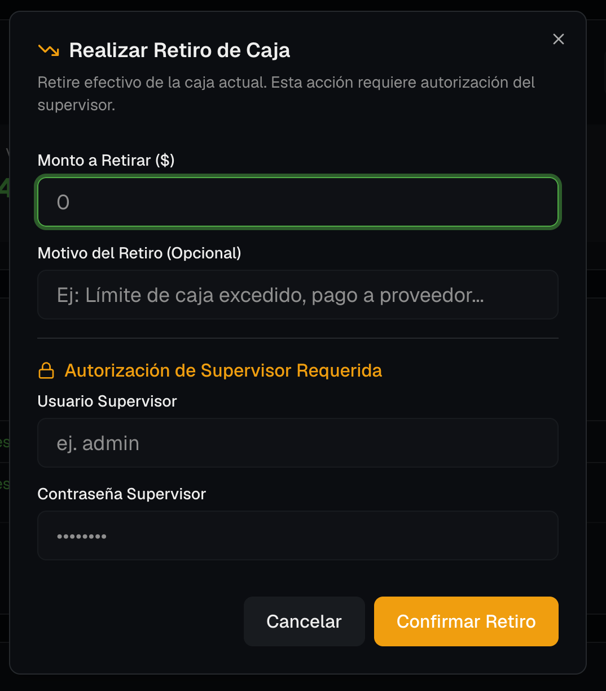
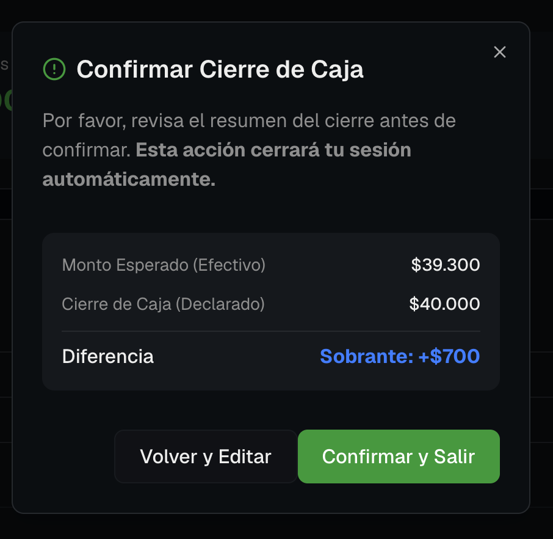
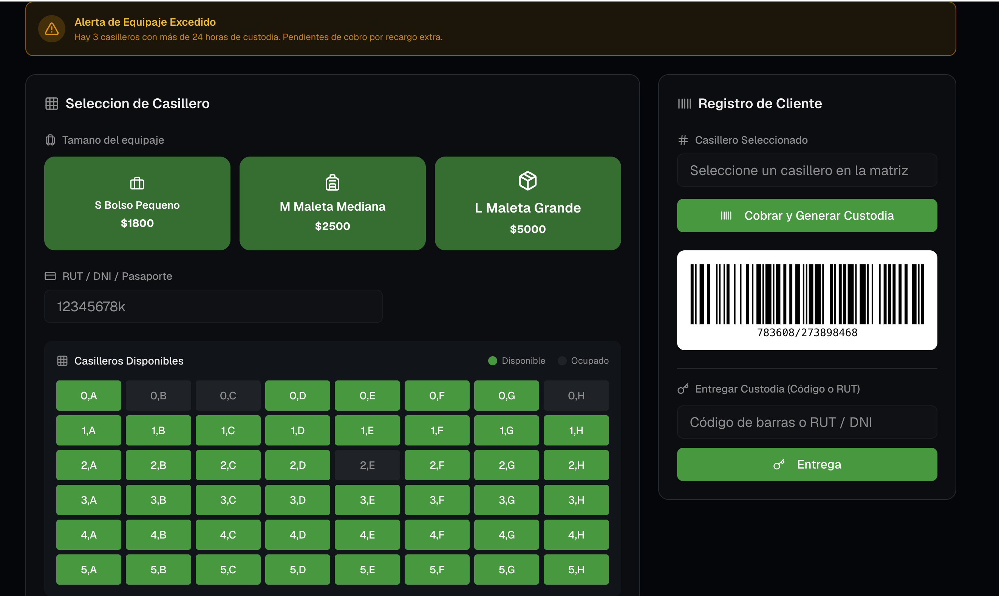
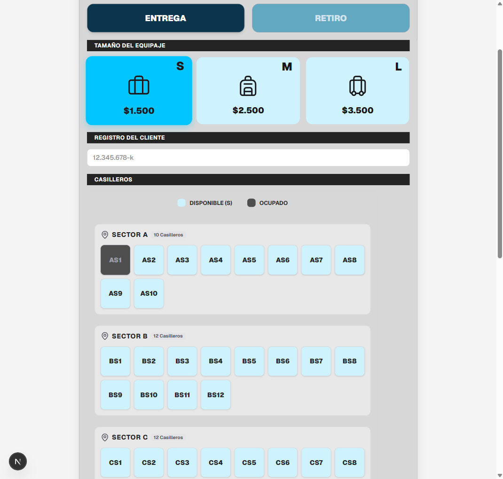
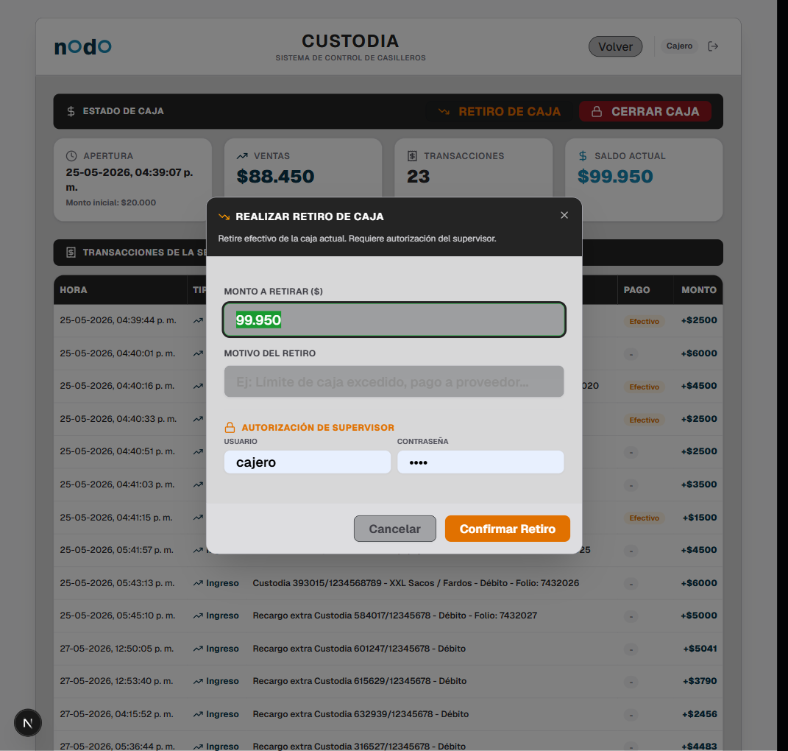

# PRD - Sistema de Custodia Terminal Sur

Este documento detalla los requerimientos del Software de Custodia para el Terminal Sur de WIT, con fecha de referencia 07/02/2026.

---

## Requerimientos y Estado de Implementación

- [x] **1. Capacidad de Casilleros**
  - Agregar 250 casilleros al perfil de la vista de venta.
  
- [x] **2. Filtro por Tamaño**
  - Los casilleros deben estar filtrados por tamaño: Pequeño (S), Mediano (M), Grande (L).
  - Al seleccionar el tamaño, se deben desplegar los casilleros correspondientes.

- [x] **3. Operación de Caja Automatizada**
  - Al momento de realizar un retiro o cerrar la caja, el sistema debe indicar automáticamente el monto existente. No debe ser manual ni requerir que un supervisor lo agregue.
  
  

- [x] **4. Comprobante de Retiro**
  - El sistema debe entregar un comprobante de retiro (arqueo de caja) al realizar el mismo para su debido registro.
  
  

- [x] **5. Etiquetado de Espacios (Sectores A, B, C, D)**
  - Definir las etiquetas de los casilleros según su área, tamaño y número correlativo en base a los espacios disponibles:
    - **Área A**: 
      - AS1 a AS10 (10 casilleros Pequeños)
      - AM1 a AM8 (8 casilleros Medianos)
      - AL1 a AL8 (8 casilleros Grandes)
    - **Área B**:
      - BS1 a BS12 (12 casilleros Pequeños)
      - BM1 a BM6 (6 casilleros Medianos)
      - BL1 a BL6 (6 casilleros Grandes)
    - **Área C**:
      - CS1 a CS12 (12 casilleros Pequeños)
      - CM1 a CM6 (6 casilleros Medianos)
      - CL1 a CL6 (6 casilleros Grandes)
    - **Área D**:
      - DS1 a DS6 (6 casilleros Pequeños)
      - DM1 a DM4 (4 casilleros Medianos)
      - DL1 a DL4 (4 casilleros Grandes)
  
  

- [x] **6. Representación Visual del Espacio Físico**
  - Diseñar una representación visual (distribución del espacio físico por sectores A, B, C, D) dentro del sistema para facilitar la operación y ubicación rápida de los casilleros por parte de los cajeros.

---

## Evidencias de Validación (Localhost 2026-07-02)

A continuación se presentan las capturas de pantalla obtenidas durante la validación del sistema en el entorno local:

### 1. Vista de Casilleros con Distribución por Sectores y Etiquetas
Se puede observar que los casilleros se muestran agrupados según su sector físico (A, B, C, D y Otros) y muestran la etiqueta del casillero (ej. `AS1`, `BS1`) dentro de cada botón. Además, al realizar una reserva el casillero se marca como ocupado y se deshabilita automáticamente.

### 2. Retiro de Caja con Saldo Automatizado
El diálogo de retiro de caja pre-calcula e indica automáticamente el monto exacto existente en la caja ($99.950 en la sesión de prueba), sin requerir el ingreso manual.

### 3. Comprobante de Cierre de Caja (Arqueo de Caja)
Al confirmar el cierre de caja, el sistema genera de forma automática el comprobante de arqueo de caja con el detalle completo del turno (ventas en efectivo, ventas en tarjeta, egresos/retiros y diferencias). Este comprobante se envía a la ticketera antes de cerrar la sesión automáticamente.

